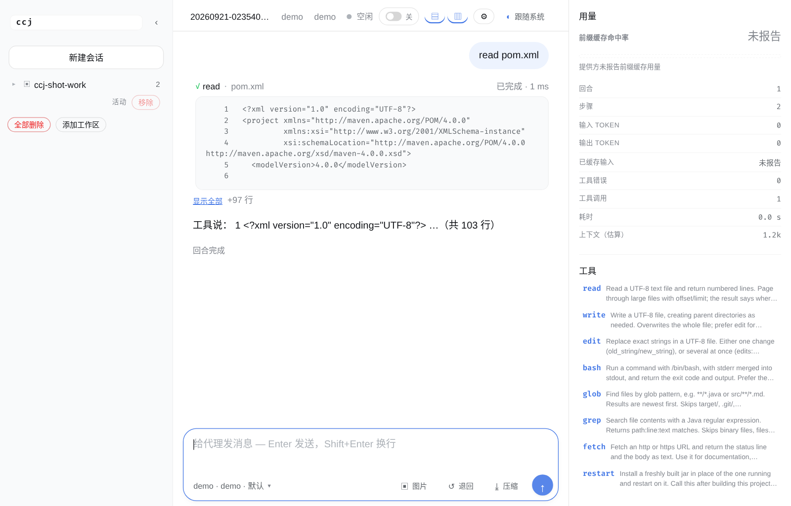

# oh-my-ccj

[](https://github.com/yMvvL/oh-my-ccj/actions/workflows/build.yml)

**A coding agent in plain Java 21, written from scratch.** No agent framework, no HTTP client library,
no CLI library: the transport is `java.net.http`, the web UI and every test double ride on
`com.sun.net.httpserver`. Exactly one runtime dependency (Jackson), no build step for the page it
serves, and a test suite that runs offline. It streams from the model, lets it call eight tools that
touch your filesystem, and asks you before anything runs.

**Status: a personal tool, not a product.** Built for one person and used daily. There is no support,
no release cadence, and no backwards-compatibility promise — the version number is decoration until
there is a release to point at. Everything below, and the UI itself, is in Chinese; that is the
language the project is written in. If you want to see what it is before reading any of it:

```
./mvnw -DskipTests package && ./ccj --demo     # no API key, no network
```

Requires JDK 21+ on Linux or macOS. MIT licensed ([LICENSE](LICENSE)). It is deliberately *not* a
sandbox: the approval prompt is the only guard, and `--yolo` removes it.

---

从零开始用纯 Java 21 写成的编码代理运行时。没有代理框架，没有 HTTP 客户端库，没有 CLI 库——传输用
`java.net.http`，Web UI 和测试替身用 `com.sun.net.httpserver`——22.7k 行 Java 加一个 8.8k 行的原生页面，
旁边还有 21.7k 行测试（其中 2.5k 行跑在真 node 里，包括一个真浏览器）。

`ccj` 与模型流式地对话，让模型调用能触碰你文件系统的工具，把结果回喂给它，如此重复直到模型给出回答。
它是每个编码代理都围绕的那个循环的一个小巧、可读的实现。

```
$ ccj -p "add a null check to Parser.java and run the tests"
⚙ read Parser.java
✔ read (3 ms)
⚙ edit Parser.java
✔ edit (1 ms)
⚙ bash mvn -q test
✔ bash (8420 ms)
    exit code 0
Added the check on line 42 and the suite passes.
```

## 为什么选它

别的编码代理有的是。以下是这个做了、而它们大多没做的事，每一件都是长会话或被中断的会话会出问题的地方：

- **被中断的回合会被修复，而不是致命。** 在助手回合与它请求的工具调用之间杀掉进程，你就得到一份再没有
  任何 API 会接受的历史——之后每个请求都被拒，对话就此死掉。ccj 在它发送的投影里补上缺失的结果
  （「未运行」才是实际发生的事），并把错位的回答带回提出请求的那个回合，于是会话得以继续。
- **`/compact` 是可逆的。** 压缩通常是单向的损失：旧回合没了，只剩下摘要。这里它会写出同一个会话的
  *新一代*，原始文件原封不动，而且摘要会点出那个文件名，模型就能把被丢掉的细节 `read` 回来。当摘要不会
  比它替换的内容更小时，它还会拒绝运行——在一个真实会话上实测是 4239 → 4236 token，纯属花了钱没好处。
- **代理能读自己的历史。** 会话就是普通 JSONL，放在 `read` 工具够得到的目录里，上面那条才可能成立。
- **上下文裁剪保持协议有效。** 先省略旧的工具输出，再丢掉整个来回——绝不把助手回合和它发起的调用结果
  拆开。
- **子代理的改动要经过你的审批。** 它在一个你看不见的会话里读东西，但写入和你自己的写入一样要问你，
  中止该回合就是给了答复。它也不能再往下委派：那个工具根本不在它的注册表里。
- **Web UI 能从手机访问，却不必暴露在公网上。** 它只绑定具名地址——loopback 加上你的 tailnet——从不绑
  通配地址，而且每个非 loopback 地址都需要 token。会改变状态的跨源请求一律拒绝。

它刻意不做的东西：插件、沙箱、多用户账号。图片是以描述而不是以图像的形式到达的——见下文「图片」一行——
其余都在[限制](#限制)一节。

## 运行之前请先读这一节

`ccj` 会在你的机器上执行 shell 命令。这正是它的全部意义，也意味着下面这些边界不是小字条款——它们就是
设计本身。

- **代理以你的身份、带着你的环境运行。** `bash` 没有沙箱，不限于某个目录，也不受命令清单限制。你能敲的
  东西，它都能敲。
- **审批是唯一的防线。** 会写入或执行的工具先发问；没有终端可问时，它们是*被拒绝*，而不是被当成默认
  同意。`--yolo`（或 UI 里的自动批准）会把这层防线整个拿掉；在一个同时还能被网络访问到的会话上，这个
  组合按设计就是远程代码执行。
- **Web UI 是一个能通过 HTTP 够到的 shell 提示符。** 它只在你指名的地址上服务，从不绑通配地址；除
  loopback 外每个地址都需要 token（`~/.oh-my-ccj/web-token`，32 个随机字节，`0600`，首次需要时生成）。
  在能连上这个端口的设备和执行命令的能力之间，只有这个 token。把带 token 的 URL 当密码对待：它只在启动
  时打印一次，只有你自己把它粘进 shell，它才会出现在你的 shell 历史中。
- **不要把它暴露给你不掌控的网络。** tailnet 地址是合理的，因为能连上它的设备集合由你管理。公网接口
  ——VPS、端口转发、咖啡店网络——就不合理，token 也改变不了这一点：它只是过滤来者，并不能让这个服务
  可以安全地对外发布。

这些都不是以后要修的缺陷；跑不了命令的编码代理干不了这活。这也是 `ccj` 被做成一台你自己拥有的机器上的
个人工具的原因。

## 快速开始

```bash
./mvnw package                   # builds target/ccj.jar (shaded, no classpath juggling)

./ccj                            # opens the web UI; configure your model there
./ccj --demo                     # the same, with a local stand-in model: no key, no network
./ccj --repl                     # terminal REPL instead of the browser
./ccj -p "what does src/Main.java do?"   # one-shot
```

首次运行时还没有配置模型，所以 Web UI 会打开它的设置面板并索要一个——提供方、模型、base URL、API key。
保存会写入 `~/.oh-my-ccj/config.json`（0600）并立即切换正在运行的会话：不用重启，不用手改 JSON。脚本化
使用时，命令行 flag 和环境变量依然可用。

### 运行环境

**Linux 和 macOS，需要 JDK 21+。** 启动器（`./mvnw`）自带 Maven，所以不必安装 Maven——但需要一个 shell，
这是一项真正的依赖，而不是顺带的前提：

| 需要 | 原因 |
|---|---|
| 一个 shell | `bash` 工具和编辑后检查通过它执行命令。用哪个程序是可配置的：`config.json` 里的 `"shell"`、`--shell <文件>`，或环境变量 `CCJ_SHELL`；不配置时 POSIX 上是 `/bin/bash`，Windows 上是 `%COMSPEC%`（没有它时 `cmd.exe`）。 |
| POSIX shell 工具 | 启动器（`ccj`）用到 `readlink`；各工具期望 `grep`、`find` 之类按惯常方式工作。 |
| JDK 21+ | `./mvnw` 和 `java -jar` 都需要它。 |

**Windows 上跑命令的机制已经就位，但没有被验证过。** 写死的 `/bin/bash` 没有了：`--shell` 可以指向任何
程序，`bash` 工具与编辑后检查用的是同一个，仓库根下还有一个不依赖 bash 的启动器 `ccj.cmd`。可是维护者的
机器和 CI 上都没有 Windows（CI 只跑 `ubuntu-latest` 和 `macos-latest`），所以「一个回合在 Windows 上跑
起来」是这些机制要达成的目标，而不是一次被观察到的运行——`cmd.exe` 收 `/c`、PowerShell 收
`-NoProfile -Command` 这类形状是照着文档写下的，没人试过。**WSL 仍然是唯一有人跑过的那条路**：在 WSL 里，
上面每一条都成立。

其它什么也不需要：不需要 Maven，不需要 Node（Node 缺席时浏览器用例会被跳过，并且*报告*为跳过——CI 会装上
它，所以不可能悄悄蒙混过去），不需要 API 密钥（`--demo` 跑的是本地替身模型）。

## 安装

把启动器放进 `PATH` 一次，就能像任何别的 CLI 一样在任意目录里用 `ccj`：

```bash
./mvnw -DskipTests package                    # or let the launcher build it on first use
ln -sfn "$PWD/ccj" ~/.local/bin/ccj           # ~/.local/bin is on PATH by default
cd ~/some/other/project && ccj -p "explain this repo"
```

启动器运行 `java -jar target/ccj.jar`，当 `src/main` 下的任何文件——包括那个页面，不只是源码——或
`pom.xml` 比 jar 新时就会重新构建，所以这个符号链接不可能跑到过期的代码。工具按当前工作区解析相对路径，
工作区默认是你启动 `ccj` 时所在的目录，直到你另选一个（`-C` 对单次运行覆盖它，会话会说明这一点）；会话
存放在 `~/.oh-my-ccj` 下，跨项目共享（`--home` 可以把它们隔离开）。密钥放在环境里或配置文件里——`ccj`
是个小程序，不是服务。

Windows 上是仓库根下同一个文件的 `ccj.cmd`：把它所在的目录放进 `PATH`，敲 `ccj` 就行（`PATHEXT` 让
`.cmd` 不必写出来），它用 `%~dp0` 找到仓库根，所以从任何位置调用都对。它与 `ccj` 只差一处——只看
`target\ccj.jar` 在不在，不看源码新旧，因为 `find -newer` 在 CMD 里没有对应物（要它重建，先删掉那个 jar）。
见 [docs/BOOTSTRAP.md](docs/BOOTSTRAP.md)。

想要连运行时一起带走的安装包，见 [docs/USAGE.md](docs/USAGE.md) 末尾那一节。

### 不用 API 密钥也能试

```bash
ccj --demo                        # web UI with the stand-in model
ccj --demo --repl                 # the same in the terminal
ccj --demo -p "read pom.xml"      # one-shot
```

`--demo` 把模型换成一个本地工具路由器：`read <path>`、`run <command>`、`list [glob]` 和
`search <regex>` 会变成**真正的**工具调用，其它输入则用这套词汇回答。其余一切照旧——同一个循环、同一批
工具、同样的审批提示、同样的会话——而且不需要密钥、不需要网络、不需要第二个进程。这是观察代理干活最快的
方式。

## Web UI



*上面这一张是 `./ccj --demo` 里真的跑了一个回合之后截的：`read pom.xml` 是一次真实工具调用，右边的用量
面板是真的账本。*

这个页面流式显示助手的散文，把每次工具调用显示成带参数、耗时和输出的卡片，并把审批请求渲染成阻塞卡片，
上面是五个回答——拒绝 / 只允许这一次 / 本会话都允许 / 始终允许 / 以后都拒绝——因为它本来就是：循环线程
一直停着，直到有人回答，超时即拒绝。回答以 markdown 到达，并在流式传输的同时按 markdown 渲染（标题、
列表、表格、围栏代码、链接）。会话就是 CLI 用的那批 JSONL 文件，所以在终端里开始的对话能在浏览器里
继续，反过来也一样。
见 [docs/WEBUI.md](docs/WEBUI.md)。

### 用手机通过 Tailscale 访问

如果这台机器在某个 tailnet 里，`ccj` 已经在为你的手机服务了：打开打印出来的第二个 URL 一次，token 就落进
HttpOnly cookie，之后的书签就什么都不用带。Tailscale 只是**最省事**的那条路，不是必需的那条：局域网、SSH
端口转发、别的 mesh VPN、隧道和反向代理各自怎么配、各自要注意什么，见
[docs/WEBUI.md](docs/WEBUI.md) 的「从别的设备访问」。

## 它能做什么

| 能力 | 细节 |
|---|---|
| 提供方 | 任何 OpenAI 兼容端点（`/chat/completions`，SSE）和 Anthropic（`/v1/messages`，SSE）。流式传输并增量拼装工具调用，遇 408/429/5xx 退避重试。 |
| 自定义提供方 | 在设置面板里或通过 HTTP 定义你自己的提供方：一个名字、一个协议、一个端点、一个可选的密钥变量名以及它提供的模型。中继、网关、本地 vLLM 或你自己的 API 路由器都只是一个定义，而不是一次发版。**任何**提供方（包括内置的）的模型列表都可编辑并持久化，所以手输的模型会成为被记住的选择，而不是一次性的。你不用的提供方可以直接从选择器里移除：你自己的定义会被删除，编译进去的别名则离开列表（列表变成显式的，加回来就是一次普通的添加）。 |
| 端点和密钥 | 它们属于当初输入它们时所选的提供方，配置文件为每个提供方保留一对：生效中的那一对，加上你配置过的每个其它提供方的 `remembered` 条目。切换提供方会载入新提供方的那一对，而不是把旧的那对传下去，所以会话不可能给刚离开的提供方记上账——切回去时也不必再贴一遍密钥。 |
| 工具 | `read`、`write`、`edit`、`bash`、`glob`、`grep`——每个都有手写的 JSON Schema 和自我说明的错误。`bash` 执行命令时它的 stdin 已经关闭，所以 `cat`、`sort` 或脚本里的 `read` 看到的是输入结束，而不是去等一个并不存在的终端。三个只读工具声明自己是只读的，在一个回合里连着跑它们会并发执行。 |
| 循环 | 每个对话同一时刻只有一个模型回合；每一个被请求的工具都会执行，结果回传，然后再次问模型。没有步数上限——回合在模型给出回答或你中止它时结束，因为上限区分不出卡住的模型和正在啃长任务的模型。中止是真的：正在跑的 shell 命令会被杀掉，而不是等它跑完。 |
| 子代理 | 代理可以把一件自成一体的任务委派给子代理，子代理在自己的会话里干活，只返回一份报告：带着文件路径的结论，而不是得出这个结论的阅读过程，所以跨三十个文件的搜索只花主对话一段话。三种角色——`explore` 和 `verify` 只读，`build` 会写，它的改动和你的改动一样要审批。它不能再往下委派：`task` 不在它的注册表里，所以递归是不可能，而不只是被限制。除非传 `--subagents`，否则关闭。 |
| 项目规则 | 把 `CCJ.md` 放进某个工作目录，它的内容就会领起在那里发出的每个请求的提示词：项目自己说明这里的工作怎么做，内置规则跟在它后面，而不是被它替换。只从**那个目录**读——树上更高层的文件不会被考虑，所以「这次运行用的是哪份提示词」看一眼你启动时的目录就能回答。`--system` 仍然覆盖内置的那部分。缺失、空和读不了都表示「没有项目规则」。 |
| 上下文预算 | `--max-context-tokens`（或 `CCJ_MAX_CONTEXT_TOKENS`，或配置文件）以估算 token 数封顶一次请求所携带的内容。超出时先省略旧的工具输出，再丢掉整个更早的来回——绝不把助手回合和它发起的调用结果拆开——如果正在回答的这个来回仍然放不下，就把其中最大的结果截断并留下显式标记。会话文件保留一切；只有请求是投影，转录会说明裁掉了什么。 |
| 花费上限 | `--max-total-tokens`（或 `CCJ_MAX_TOTAL_TOKENS`，或配置文件里的 `"maxTotalTokens"`）封顶这条会话累计花掉的 token（输入加输出，按会话账本计数）。**已经越过**它的会话不再开始新回合——而不是正在跑的那个回合被砍掉，而且判定发生在回合开始之前，终端和网页是同一条规矩；拒绝信息说出已用多少、上限多少，以及三种改法：flag、配置文件里的 `"maxTotalTokens"`、环境变量 `CCJ_MAX_TOTAL_TOKENS`；不设置就没有上限。与上下文预算是两件事：预算管一次请求带得下多少，它管这条会话还值不值得接着跑。 |
| 上下文 | 侧边面板报告估算的提示词大小相对于预算（`--max-context-tokens`）的位置，这样你能在转录说「被裁剪了」之前就看出某个会话快要被裁。它是估算，并且被如实标注为估算：token 计数只是一种启发式。不显示钱——价格是对一份说改就改的价目表的假设，改时不会通知 ccj。 |
| 压缩 | `/compact`（或压缩按钮）用模型写的一段摘要替换更早的回合，这样长会话能继续下去，无需把读过的一切再发一遍。它写成同一个会话的下一代——`<id>.g1.jsonl` 紧挨着未被改动的 `<id>.jsonl`——所以被替换掉的对话仍在磁盘上、仍可读，摘要会告诉模型去哪里 `read` 回来。最新的五个来回保持原样；如果摘要不会比它替换的内容更小，就拒绝写入而不是写出去。见 [docs/COMPACT.md](docs/COMPACT.md)。 |
| 用量 | 每个会话的 prompt/output token、步数、工具调用数和**缓存命中率**，从两种协议里解析出来（`prompt_tokens_details.cached_tokens`、`prompt_cache_hit_tokens`、`cache_read_input_tokens`），在侧边面板和每个回合的 token 行里实时显示，并随会话持久化，所以继续会话就继续计数。设了花费上限时面板多一行**花费上限：已用 / 上限**——没设上限就没有这一行，一个「不设上限」的行除了占地方没有别的作用。 |
| 会话 | 追加写的 JSONL，位于 `~/.oh-my-ccj/sessions/` 下，在第一条消息时创建（空会话不留下文件），可以用 `--resume` / `--continue` 继续，UI 打开某个会话时会把它重放进转录，还能从侧栏一次删一个或一次全删——包括你当前不在的工作区里的。侧栏用你问的第一件事给每个会话打标签，因为一串时间戳 id 说明不了它当初是什么任务。被中断弄得缺少工具结果的回合（在调用和执行之间按了 `Ctrl-C`，或进程被杀），会在下一次请求时被修复，而不是永远被拒；回答被中途写入的消息挤走的回合也一样——回答会被带回提出请求的那个回合，因为 API 无法安置的 `tool` 消息就是一个会被拒的请求。 |
| 审批 | 任何写入或执行都先问；没有终端时它被拒绝，而不是被悄悄允许。 |
| 渲染 | 流式散文、带参数摘要的工具卡片、每次调用的耗时、变暗的推理、在提示出现时把终端让出来的 spinner。 |
| Markdown | 回答是 markdown，在浏览器里按 markdown 渲染：标题、列表（可嵌套，带任务框）、带语言的围栏代码、带对齐的表格、引用、行内代码、强调和链接——从流式的 delta 里解析出来，所以半途到达的回答可读，而正在写的那个块之上的块绝不会被重画。回答里的原始 HTML 按文本显示，图片不会被抓取，链接的 scheme 会被过滤。 |
| 主题 | 亮色/暗色/跟随系统，按浏览器记住，在首帧绘制前应用。 |
| MCP 服务器 | 配置在 `<home>/mcp.json` 里的服务器会把它的工具贡献给这个代理，命名为 `mcp__<server>__<tool>`，这样审批提示、规则和转录都能说出某个能力的来源。在它们的工具第一次被调用时启动——发现过程会问每个服务器一次然后关掉它，所以没人用的服务器不花任何代价——走服务器自己的 stdin/stdout，每个请求有截止时间，stderr 被排空，ccj 退出时进程被杀掉。每次调用都走和 `bash` 同一个审批者：服务器自己认为它可以做什么，不是这个程序认为的。核心**没有**搜索工具是故意的——搜索要第三方密钥与供应商选择——挂一个搜索 MCP 服务器就能加上它（例：Brave 官方的 `@brave/brave-search-mcp-server`，工具以 `mcp__search__` 开头，走同一个审批器，也能用一条 `mcp__search__*` 规则放行）。见 [docs/MCP.md](docs/MCP.md) |
| 退回 | 每个改了文件的回合都能撤回：`POST /api/undo`（或 REPL 里的 `/undo`，或输入框的退回按钮）把上一个回合的文件恢复成该回合最初看到的样子——包括删除该回合新建的文件——每按一次就再往前退回一个回合。**网页上是两步**：第一次按退回是**预览**（`GET /api/undo` 回答问题「这次会动哪些文件、还有几个回合可退」，`{"files":[{"path":"notes.txt","action":"restore"\|"delete"}],"turns":N}`，`turns` 含这一次），页面把清单摆出来等你确认或取消，第二次按才真的动磁盘；终端里的 `/undo` 一如既往，一次到位。快照（检查点）放在会话旁边（`<id>.checkpoints/<turn>/`），保留最近的二十个，超过 4 MB 的文件跳过不复制，会话目录之外的文件不归这个对话退回。这是审批的另一半：审批回答「它可以跑吗」，退回回答「它可以被撤回吗」，只有后者才让人敢把防线留着。 |
| 前缀缓存 | Anthropic 请求带三个 `cache_control` 断点——系统提示词、工具集、对话末尾——所以第 *n+1* 个回合为第 *n* 个回合已经发过的前缀付一次缓存读取，而不是再写一遍。请求的其它部分不变，而 OpenAI 形状的那条路径完全不需要：它的前缀缓存是自动的，命中已经体现在面板的缓存率里。 |
| 自动压缩 | 修剪请求的那同一个 `maxContextTokens` 现在也会在*对话*长过它时压缩对话：只在回合之间，绝不在回合内部，而且只在摘要确实更小时。另一种做法就是投影自己会做的事——省略工具输出、丢掉整个来回，外加一条通知说丢了多少、却没有摘要说它们是什么。没配预算就没有自动压缩；一次拒绝会按两倍大小记住，因为实测发现推理模型能写出比它替换的来回更大的摘要，而每几个回合就重试一次的拒绝，是一笔永远失败的付费调用。 |
| 排队消息 | 回合运行期间打字会把消息排队，而不是被拒：输入框保持可用，提示会说明有多少条在等。回合结束后下一条自己开始，作为它自己的回合、有自己的 `done`。Abort 会停止该回合**并丢掉排在它后面的东西**，同时说明丢了多少——停止正是那个按钮的用途。一个对话最多容纳十六条；再多服务器会带着原因拒绝，而不是无上限地增长。 |
| 审批规则 | 五种回答而不是两种：拒绝、允许一次、**本会话内允许**、**从现在起允许**、**从现在起拒绝**。两个「从现在起」是一对，都会把一条规则写进 `<home>/approvals.json`（按项目为键），主语一模一样，区别只在答案：`allow` 写进允许列表，`deny` 写进拒绝列表。这条规则对下一个一模一样的请求不再发问，直接回答：`{"tool": "bash", "command": "mvn -q -o test"}`，或对同一条命令加更多参数用 `git diff *`，或 `{"tool": "edit", "path": "src/**"}`。拒绝依然优先，通配符绝不覆盖含 `;`、`&&`、`\|`、替换或重定向的命令，路径规则不能走出项目，每个自动回答都以 `allowed by rule — …` 或 `denied by rule — …` 出现在转录里。要点在于那个谁都不敢碰的开关：过去「别再问我这个了」只有一条出路，就是把它关掉——因为只有同意方向能被记住，而现在「别再问我这个了」也可以就是一个「不」。见 [SECURITY.md](SECURITY.md)。 |
| 检查 | 在编辑之后自动运行的命令，在配置文件里声明：`"checks": [{"glob": "**/*.java", "command": "mvn -q -o -DskipTests compile"}]`。第一个 glob 匹配刚写入文件的检查会在同一次 `edit`/`write` 调用里运行，它的判定随结果一起回来——通过时一行（`exit 0`，不是 "clean"：见下文），失败时一段有界的摘录。**glob 决定检查何时运行，不决定命令看什么**——实测：`**/*.java` 配上 `mvn -q -o -DskipTests compile`，仓库根目录下的一个坏文件返回的是 `exit 0`，因为 Maven 只编译 `src/main/java`，压根没看到它。把 glob 和一条覆盖 glob 所选范围的命令配成一对。这就是编译错误出现在造成它的那一步、还是三个回合之后模型想起来去找才出现之间的差别，代价是每次编辑一条命令：每次编辑一个检查、4 KiB 报告、每个检查有超时、失败的编辑什么都不跑、会话目录之外的文件也什么都不跑。运行的配置命令不经提示意味着什么，见 [SECURITY.md](SECURITY.md)。 |
| 图片 | 输入框的图片按钮（它先问**相机**还是**相册**，所以你能当场拍一张、也能从图库里选），或者直接**粘贴**一张截图、把它**拖进**窗口——三条路都走同一个上传函数，所以三种行为不会分叉——或 `POST /api/attachment`，最大 8 MB，PNG/JPEG/WebP/GIF，类型从字节里读而不是从文件名。一个**独立的视觉模型**描述它，而这段描述**等着**：它和你的下一句话拼成一条消息（`[picture photo.jpg] …` 描述在前，你的要求在后，再加一行路径，这样描述丢掉的细节还能 `read` 读回来），所以模型醒来时已经同时知道图片里有什么和你要它做什么。主模型从不接收图像，任何会话文件也不保存图像，所以没有哪种线上格式、渲染器或压缩步骤长出图像分支。转录里这条消息也不是一段纯文本：页面上它被**摆成图**——缩略图、文件名、一行说明，一段**可展开**的描述，然后才是你自己说的那句话；会话文件里那段文本一个字都没改，重放、压缩、恢复都靠它。缩略图由 `GET /api/attachment/thumb?name=<文件>` 现画（磁盘上不留缓存），只服务**这条会话附件目录里**的文件——名字解析出目录之外（`../`、绝对路径、指向别处的符号链接）就当没有这张图片——最长边 96 像素的 PNG；而解不出来的格式（WebP 是一例）**原样交回字节**，所以画不出小图不是一次错误，页面照样显示得出来。自己的端点、自己的密钥、自己的模型和自己的补全预算（`maxTokens`，默认 8192），在**设置**（*图片*一节）、配置文件的 `vision` 块里设置，或用 `--vision-base-url`、`--vision-model`、`--vision-api-key`/`--vision-api-key-env`、`--vision-max-tokens`：缺席就表示该功能关闭，关闭期间发送图片会被拒绝并说明该设什么。预算是上限而不是花费——一次描述花多少由模型写多少决定——但推理模型在写出第一个字之前就会把它花掉，所以默认给得宽裕：设成 1500 时一张手机截图返回空白，每一个 token 都花在思考上。图片本身存放在 `<sessions>/<session-id>.attachments/`——紧挨着会话，所以删掉对话就删掉它——绝不放进你的项目。见 [docs/VISION.md](docs/VISION.md)。 |
| effort 档位 | 消息框上方的一个选择器：提供方 → 模型 → `default`/`low`/`high`/`max`，按协议各自翻译（OpenAI 形状的 API 用 `reasoning_effort`，Anthropic 用扩展思考预算）。`default` 什么都不发，所以普通模型不受影响。 |
| 文件夹选择器 | 「添加工作区」*就是*文件夹选择器：点一下打开桌面自己的选择器（`zenity`、`kdialog` 或 Swing），回来的文件夹就以它自己的名字成为工作区，重名时加后缀。没有选择器的机器退回同一次点击打开的表单，所以手输路径——或用同一个选择器浏览到某个路径——总是可行的。 |
| 工作区 | VS Code 风格的侧栏：每个工作区是一个文件夹，展开就是它自己的会话，带懒加载、按行删除和按节点移除。一行用当初问它的第一件事作标签，整行都是一个点击目标，回合结束时重新读取列表，所以你刚进行的对话就在最上面。带各自会话历史的具名目录——`ccj` 启动时用的工作区保留原来的会话目录，新增的在 `<home>/workspaces/<name>/` 下拥有自己的。切换会一步同时改变工作目录*和*历史，当前工作区就是工具运行的地方，无论进程是从哪里启动的，而读一个折叠的文件夹绝不会移动你所在的会话。 |
| Web UI | `ccj` 把同一个循环作为单独一个页面来服务：流式转录、工具卡片、阻塞的审批提示、会话切换，以及运行时配置模型的设置面板。没有框架，没有构建步骤。在手机上两个面板变成盖在转录上的抽屉。它在 loopback 上服务；当机器在某个 tailnet 里时，也在它的 tailnet 地址上服务——所以同一个页面距离运行它的笔记本和兜里的手机都只有一条命令，网络那一侧唯一需要的就是一个生成的 token。 |
| 同时进行多个对话 | 一个会话里运行的回合不会锁住服务器：第一个还在干活时可以在另一个对话里开始第二个任务，侧栏会标出正在运行的会话（■ 可以从任何地方停掉一个，不用打开它）。每个会话仍然只能*一次一个*回合——两个写者写同一份转录就是它损坏的方式——而改变每个对话所依赖之物的操作（模型、配置文件、工作区）会等到没有东西在跑。消息的载荷带有它们的会话 id，所以来自后台回合的 delta 绝不可能被渲染进你正在读的转录里。 |
| 自举 | 代理可以重新构建这个项目并安装结果：`mvn -q -DskipTests -Djar.name=ccj-next package` 写出一个临时 jar，不碰正在使用的那个（截断一个 JVM 正在执行的 jar，就是进程在构建中途死掉的方式），然后 `restart` 把它改名到位，启动器运行新代码——**落回你原来那个对话**：结束的进程把那个会话 id 记下来，下一个进程打开它，所以重启不再给你一份空转录。见 [docs/BOOTSTRAP.md](docs/BOOTSTRAP.md)。 |

## 安全模型

- `read`、`glob` 和 `grep` 自由运行；`write`、`edit` 和 `bash` 需要审批。
- 有终端时，审批会问五个回答——`y` 只允许这一次、`s` 本会话都允许、`a` 始终允许、`d` 以后都拒绝（写一条拒绝规则）、其它一律算拒绝——并显示工具、完整命令、解析后的工作目录和超时；等待期间暂停 spinner。
- 没有终端时（管道、CI），有副作用的调用会被**拒绝**并给出解释，除非传了 `--yolo`。失败时收紧才是重点。
- 相对路径按 `--cwd` 解析；它之外的路径会在审批提示里被标出。

## 限制

- 每个会话同一时刻只跑一个对话。多个对话可以并行，而且代理可以委派给**子代理**——子代理在自己的会话里读，
  只回报一份摘要——除非传了 `--subagents`，否则关闭，因为一次受委派的运行会花掉用户并没有为某条消息而敲
  的 token。在一个对话内部，只有只读工具并发运行：只有它们之间的重叠不会改变转录的含义。见
  [docs/SUBAGENTS.md](docs/SUBAGENTS.md)。
- 图片是单向的，而且隔了一层：图像由视觉模型描述，*描述*加入对话。主模型从不接收图像，所以「这个错误说的
  是什么」和「把这块白板转录下来」能用，而「这个像素是不是正确的蓝色」不能——就描述丢掉的细节再问一次，
  或者 `read` 那个文件，因为它被告诉去看那里。一次一张图片，最多 8 MB；第二次上传取代还在等着的那一张，而发送之后它就跟着消息走了。
- 没有插件、没有沙箱、没有多用户账号——审批是唯一的防线，`--yolo` 会把它拿掉。
- Bash 以当前用户身份、带着你的完整环境运行。
- 磁盘上的会话会无上限地增长。放不进上下文预算的内容会被省略或丢掉；你用 `/compact` *要求*总结的会被
  总结，只有到那时它才是一份你能看见、能退回的摘要——它替换掉的回合仍然在旁边的 generation 文件里，
  摘要会点出那个文件，使模型能读回某个细节，而不是相信自己的转述。
- 回合没有步数上限，所以卡住的模型会一直调用工具，直到你中止它。这就是那个取舍：长任务绝不会在某个别人
  猜的数字上被切断，而停掉一个卡住的任务是你在看着它时做的决定，不是事先猜的。
- 除非提供方报告缓存数字，否则 `cacheHitRate` 是 `n/a`——本地模型没有缓存可命中，也不会被报成 0%。
  用量总计覆盖一个会话（它们存在对话旁边，每个回合一条记录），不是一个项目或一个账单周期。
- OpenAI 那条路径针对的是 chat-completions API，不是更新的 Responses API。
- 当你让 UI 保存 API 密钥时，它是以明文存储的（文件是 `0600`）；把密钥留在环境里只差一个下拉框。
- Web UI 是一个本地控制台：多个对话可以同时干活，但一个浏览器页面显示一份转录，而且没有账号。它在具名
  地址上服务——loopback，加上这台机器有 tailnet 时的 tailnet 地址——从不绑通配地址，所以这个端口在用户
  没有指名的任何网络上都不存在。loopback 什么都不需要；其它每个地址都需要 token，因为代理能跑 shell
  命令。在 tailnet 内部，token 是区分设备的东西：网络决定谁在附近，token 决定谁被放进来。
- 同一个工作区里可以有多个对话在跑，这意味着它们的工具能写同样的文件，彼此之间没有任何先后顺序。这和同
  一个目录里开两个终端是同一种暴露面，而且是刻意不做串行化的——要点就是开始一个任务然后继续干别的。不交给
  运气的是*单个*工具：`edit` 拒绝已经变动的文本，`write` 拒绝在它的提示还开着时出现或改变过的文件，
  所以被写下去的正是你审批过的那份差异。
- `abort` 在步骤之间、每次工具调用之前停止一个回合，所以一个卡在模型自己的网络调用上的回合会先把那次调用
  跑完再停。等待审批的回合会立即停止，并且停在它所属的那个对话里。

## 更多

- **[docs/USAGE.md](docs/USAGE.md)** — 用法：命令行 flag、REPL 命令、配置文件与环境变量、每个工具的 schema、工作区，以及连运行时一起带走的安装包。
- **[docs/WEBUI.md](docs/WEBUI.md)** — 页面的每一部分，以及从别的设备（tailnet、局域网、SSH 端口转发、隧道、反向代理）够到它时的门禁与代价。
- **[docs/ROUTER.md](docs/ROUTER.md)** — 自定义提供方，`ModelCatalog` 这条接缝，以及提供方、端点和密钥在配置文件里怎么存。
- **[docs/ARCHITECTURE.md](docs/ARCHITECTURE.md)** — 分层、目录职责、消息模型、循环算法与线上映射。
- **[docs/BOOTSTRAP.md](docs/BOOTSTRAP.md)** — 启动器与 `ccj.cmd`，以及代理重新构建自己、并落回同一个对话。
- **[docs/MCP.md](docs/MCP.md)** — MCP 服务器的配置、命名与审批。
- **[docs/SUBAGENTS.md](docs/SUBAGENTS.md)** — 子代理的三种角色、它在哪里写文件，以及故意没有的东西。
- **[docs/COMPACT.md](docs/COMPACT.md)** — `/compact` 的分代文件，以及它什么时候会被拒绝。
- **[docs/RESUME.md](docs/RESUME.md)** — 一份面向简历的项目总结。
- **[docs/VISION.md](docs/VISION.md)** — 愿景：图片从手机到达、由视觉模型转成文本。
- **[docs/ROADMAP.md](docs/ROADMAP.md)** 与 **[docs/CHANGELOG.md](docs/CHANGELOG.md)** — 要往哪去，以及去过哪。
- **[CONTRIBUTING.md](CONTRIBUTING.md)** — 怎么跑测试、按包分的测试数、写作与代码风格、不在范围内的东西。
- **[docs/CONVENTIONS.md](docs/CONVENTIONS.md)** — 代码、测试和文档怎么写，以及每条规则由谁检查。
- **[SECURITY.md](SECURITY.md)** — 防住了什么、审批规则、没有防住什么。
